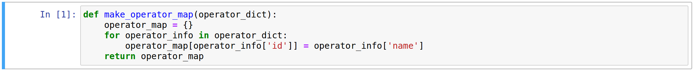
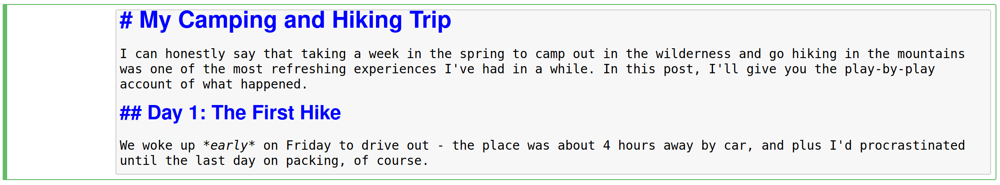

# Reading 0: Tools and Python Basics

In this chapter, you will learn about some of the tools you will use throughout
this course as you learn software design. You will also learn a bit of basic
Python. After reading this chapter, you should have enough information to
reference as you learn to work with code and submit assignments in Assignment 0.

## Table of Contents

- [Markdown](#markdown)
  - [Optional Exercise: Markdown Tutorial](#optional-exercise-markdown-tutorial)
- [Jupyter](#jupyter)
- [The Command Line](#the-command-line)
  - [The Bash Prompt and Command Usage](#the-bash-prompt-and-command-usage)
  - [ls](#ls)
  - [cd](#cd)
  - [mv](#mv)
  - [cp](#cp)
  - [rm](#rm)
- [Git](#git)
  - [Repository Overview](#repository-overview)
  - [Cloning a Repository](#cloning-a-repository)
  - [Checking the Repository Status](#checking-the-repository-status)
  - [Adding and Removing Files](#adding-and-removing-files)
  - [Committing Your Changes](#committing-your-changes)
  - [Pushing Your Changes](#pushing-your-changes)
  - [GitHub and Forking](#github-and-forking)
- [A Preview of Python](#a-preview-of-python)
  - [Integers](#integers)
  - [Strings](#strings)
  - [Lists](#lists)
  - [Comments](#comments)

---

## Markdown

Markdown is a simple language for structuring text that is designed to be easy
to read and write. Technically, Markdown is a programming language with a very
specific application (structuring text), and so is written as _source code_
(plaintext) that is then displayed as text with special formatting for
structural elements such as section headers, links, images, and code.

It is important to note that Markdown is primarily aimed at _structuring_ text
rather than _formatting_ text. On its own, Markdown does not provide a way to do
things like change the font or font size, resize images, or use different colors
for links. Part of the reason for this is that Markdown was originally designed
to be converted to Hypertext Markup Language (HTML) and used on the Web, where
it is typical to use Cascading Style Sheets (CSS) to format text.

Files that are purely Markdown usually end in `.md`, but the language is used in
a wide variety of applications. Jupyter notebooks (which most assignments will
be) use Markdown to format non-code portions, and so the assignment is written
almost entirely in Markdown. If you are viewing an assignment in the Jupyter
notebook viewer, you can probably see the Markdown source by double-clicking a
section of text. To switch from source back to formatted text, press
`Ctrl-Enter`.

As your first foray into learning Markdown syntax, you should read GitHub’s
[Mastering Markdown](https://guides.github.com/features/mastering-markdown/)
page.

If you are interested, you can view more about Markdown in the
[Additional Markdown Tips](https://softdes.olin.edu/docs/readings/additional-markdown-tips/)
reading, but this is purely optional.

### Optional Exercise: Markdown Tutorial

This interactive [Markdown tutorial](https://www.markdowntutorial.com/) guides
you through a few more Markdown concepts not mentioned above and has some
helpful practice exercises. While these additional concepts are useful in the
right context, we will probably not use them for the assignment.

---

## Jupyter

Jupyter is an interactive computing platform for _notebooks_, structured
documents that can display and run both formatted text and code. Jupyter is
often used for Python and rather popular in the data science community, although
its use is not limited to either of these.

A notebook consists of a series of _cells_, which are (usually short) blocks of
text or code that can be run. Each cell can be a Markdown cell, code cell, or
raw cell, but in this course we will only use Markdown and code cells. As its
name suggests, a _Markdown cell_ contains Markdown source that, when run,
displays the formatted text corresponding to the source. A _code cell_ contains
code that can be run to display its output. All of a notebook’s code cells are
written in a single language (in our case, Python). A code cell looks like this:



Because each cell’s code can be run independently of other code cells, the
number to the left of the cell shows the order in the code cells were run.

Future assignments will be Jupyter notebooks containing only Markdown cells. As
we mentioned above, double-clicking a Markdown cell shows the source for the
formatted text and allows you to edit the source. Pressing `Ctrl-Enter` “runs”
the source to display formatted text.

Jupyter Notebook (note the capitalization) is a web application used to run and
edit Jupyter notebooks, and likely the application you are using for the
assignment. JupyterLab is a newer application for working with Jupyter notebooks
that works in mostly the same way, but with a significantly redesigned
interface. In Jupyter Notebook, a selected cell will appear with a blue or green
bar on the left. Blue means that the cell is selected and that you are in
_command mode_, where you can do operations such as copying a cell or merging
two cells. Green means that you are in _edit mode_, and you should see a text
cursor somewhere in the cell. A cell in edit mode looks like this:



Note that in other notebook editors such as JupyterLab, the colors for these
modes may be different. Since this is a Markdown cell, it does not have a
number.

From command mode, you can press `Enter` to enter edit mode for the selected
cell, and `Esc` to return to command mode, keeping the cell selected. In command
mode, you can use `Up/Down` to select the cell above or below the current one.
You can also use `j/k`, which some find easier because the keys sit just below
your right index and middle fingers on the home row of most standard QWERTY-like
keyboards. You can type `h` from command mode to see a list of all possible
command shortcuts (and press `h` again to dismiss the list). We encourage you to
take a look at the commands and try to make a habit of using them as you work
with Jupyter notebooks.

In the assignment exercises, you will have the chance to practice editing in
Jupyter notebooks, which also gives you the opportunity to try out some of the
keyboard shortcuts for operations like adding and editing cells.

To start working on Jupyter Notebooks, run the command `jupyter notebook` in
Ubuntu. You will get some output and your Web browser may launch. For Jupyter
Lab, run the command `jupyter lab` instead. You may want to try both to see
which interface you like better.

---

## The Command Line

Most people interact with a computer through a _graphical user interface (GUI)_,
but many tasks in computing can be more efficiently done through a _command-line
interface (CLI)_. Learning to effectively use a CLI is an important skill in
computing, particuarly if you plan on using computing beyond this course.

You can access a CLI through Unity by clicking "shell" after logging in, or by
selecting a terminal in VS Code (this is in the computational setup instructions.)
An example of a CLI is below.


As you can see, the command line is a primarily text-based interface, having
little to no support for displaying graphics, and, as its name suggests, users
interact with a CLI by inputting lines of text that are interpreted as commands.
In this section, we will walk you through the basics of using the command line
that you will use to submit your completed Assignment 0.

### The Bash Prompt and Command Usage

In the picture above, the line `(base) steve@DESKTOP-PSCV8TC:~$` is called the
_prompt_ because it prompts the user for input (shown by the cursor to its
right). Most prompts also show some information about the shell and/or system,
as seen in the picture. When you type text into the terminal, the characters
will appear to the right of the prompt.

On many sites, you will see Bash commands written like this:

```bash
$ ls
```

The `$` indicates that this is a command in Bash, and should not be included (in
other words, this is telling you to type `ls` and press `Enter`). A more
complicated command might look like this:

```bash
$ unshare -r --fork --pid unshare -r --fork --pid --mount-proc bash
```

(Don’t worry about what this command actually does.) The first word in the
command (`unshare`) is the name of a program that the shell will run, and the
remaining words are called _arguments_ to `unshare`. The arguments that start
with one or more hyphens such as `-r` and `--fork` are called _flags_ or
_options_.

If you mistype a command, you will see a message like this:

```bash
$ unshre -r --fork --pid unshare -r --fork --pid --mount-proc bash

Command 'unshre' not found, did you mean:

  command 'unshare' from deb util-linux (2.34-0.1ubuntu9)

Try: sudo apt install <deb name>
```

With this in mind, we can move on to learn about a few basic commands that you
will need for the assignment.

As you read through the command descriptions and try them out for yourself, it
may help to know that you can use the Up/Down arrows or `Ctrl-P`/`Ctrl-N` to
access and switch between previously typed commands, and you can use `Ctrl-A`
and `Ctrl-E` to go to the beginning or end of the command you are currently
typing. We will mention a few other tips for more efficiently working in Bash as
we describe the commands.

### ls

Common Bash commands are often abbreviations for words that describe the task
being done. For example, `ls` is short for “list”, and lists all the files in a
folder. By default, `ls` shows all of the files in the current folder. Here's an
example:

```bash
$ ls
Anaconda3-2020.02-Linux-x86_64.sh  anaconda3
```

On some machines, `anaconda3` is highlighted, indicating that it is a
_directory_, that is, a folder. By default, when you start a shell on most
operating systems, you start in your _home directory_ specific to your user. On
Linux-like systems, the home directory is written as `~` (as you can see in the
prompt), but can also be written as `/home/user` (replace `user` with your
username).

You can also use `ls` to view the contents of other directories. For example,
running `ls anaconda3` would show the contents of the `anaconda3` directory.
Calling `ls` with multiple arguments will perform `ls` for each one, so if you
had two directories called `foo` and `bar`, you can run `ls foo bar` to see the
contents of both directories at once.

While typing `ls anaconda3`, you can hit `Tab` in the middle of `anaconda3`, and
you will see that Bash completes the name of the directory for you. Generally,
if you hit `Tab` when typing an argument that is the name of a file or
directory, Bash will try to complete the name for you. If there are multiple
possibilities (for example, if you just typed `a` and there were multiple
directories starting with `a`), Bash will complete as much of it as it can, up
to the first differing character. If you hit `Tab` additional times, Bash will
print out the remaining possibilities, allowing you to type further characters
in.

You can also use `ls` to view files and information about them. For example,
typing `ls Anaconda3-2020.02-Linux-x86_64.sh` will just print
`Anaconda3-2020.02-Linux-x86_64.sh`, which is not very useful, but if you type
`ls -l Anaconda3-2020.02-Linux-x86_64.sh`, you will see this:

```bash
$ ls -l Anaconda3-2020.02-Linux-x86_64.sh
-rwxrwxrwx 1 user user 546910666 Mar 11 12:04 Anaconda3-2020.02-Linux-x86_64.sh
```

The `-l` flag prints extra information about the file, including the size of the
file in bytes (546910666) and when the file was last modified (March 11, 2020 at
12:04 PM). The other information will probably not be useful in this course, but
it can be helpful to know that if the first part of the output starts with `d`,
such as `drwxrwxrwx` rather than `-rwxrwxrwx`, it means that the name in
question refers to a directory.

### cd

The `cd` command is short for “change directory” and is used to move to another
directory. Unless there is an error, `cd` does not produce any output, but on
some systems you will still see a change when moving into a new directory:

```bash
(base) user@DESKTOP-PSCV8TC:~ $ cd anaconda3
(base) user@DESKTOP-PSCV8TC:~/anaconda3 $
```

To move to a directory like `~/anaconda3`, you do not have to be in the _parent
directory_ containing `anaconda3` (in this case, the parent directory is `~`).
You can move directly to a new directory, like `cd /usr/bin`.

Each directory contains two special directories that are not shown by default:
`.` refers to the current directory, and `..` refers to the parent of the
current directory. So if you are in `~/anaconda3` and want to move to `~`, you
can type `cd ..` rather than `cd ~`.

Finally, running `cd` on its own will change to `~` by default. If your username
is `user`, the directory `~` is short for `/home/user` (`/Users/user` on macOS).

### mv

The `mv` command is short for “move” and is used to move or rename a file or
directory. For example, if you want to change the name of a file, you can do
something like this:

```bash
$ mv Anaconda3-2020.02-Linux-x86_64.sh anaconda-installer.sh
$ ls
anaconda-installer.sh anaconda3
```

Usually, `mv old-name new-name` will rename the file or directory `old-name` to
`new-name`. But if a file or directory called `new-name` already exists, things
get a little complicated:

- If `old-name` and `new-name` are both files, then `new-name` will be
  overwritten with `old-name` (so `new-name` will be deleted and `old-name` will
  be renamed to `new-name`).
- If `old-name` is a directory and `new-name` is a file, then `mv` will fail
  with an error.
- Otherwise, `new-name` is a directory, and regardless of whether `old-name` is
  a file or directory, it will be moved _into_ `new-name`.

You should be very careful when using `mv`, because **there is no undo operation
for most Bash commands**. If you overwrite a file using `mv`, you will probably
not be able to recover it. (However, if you rename a file and want to undo the
change, you can just rename it back with `mv`.)

Finally, you can pass many arguments to `mv` if the last argument is a
directory. In this case, all other files will be moved into the directory. So
for example, if you have files `foo`, `bar`, and `baz`, and you want to move all
of them into the folder `qux`, you can run `mv foo bar baz qux`.

### cp

The `cp` command is short for “copy” and is similar to `mv` except that it does
not remove the old file. Because `cp` makes a copy of a file, it takes longer to
run for larger files. For example, running `cp` on the renamed
`anaconda-installer.sh` file from earlier can take a few seconds, whereas the
same command with `mv` instead of `cp` is nearly instantaneous.

There are a few differences between `cp` and `mv`. Most notably, copying a
directory on its own will not work:

```bash
$ cp anaconda3 anaconda4
cp: -r not specified; omitting directory 'anaconda3'
```

As the error message suggests, the `-r` flag is necessary when copying
directories. The correct syntax would thus be `cp -r anaconda3 anaconda4`,
though we recommend you don’t run that exact command, as the `anaconda3`
directory is several gigabytes in size.

### rm

The `rm` command is short for “remove”. As its name suggests, `rm` removes files
or directories, and should be used with caution. If used on a file, `rm` will
permanently remove that file _without any confirmation_:

```bash
$ ls
anaconda-installer.sh anaconda3 foo
$ rm foo
$ ls
anaconda-installer.sh anaconda3
```

However, if `rm` is used on a directory, it will not be removed by default:

```bash
$ ls
anaconda-installer.sh anaconda3 bar
$ rm bar
rm: cannot remove 'bar': Is a directory
```

To remove a directory `bar`, use `rm -r bar` instead. Make sure to exercise
caution, as this will irretrievably remove _all_ files in `bar`, as well as
`bar` itself.

---

## Git

Note: parts of this section have been adapted from Chapter 1 of
[Pro Git](https://git-scm.com/book/en/v2). This section mainly covers material
from Sections 1.1-1.3 and 2.1-2.2 of the book.

Software design is a collaborative, iterative process. As work on a software
project goes on, many people can be working with the same code, updating it with
different features, documentation, or bug fixes. Sometimes, a change to code can
introduce bugs that cause software to run in undesired ways.

Without the proper safeguards, software design can turn into a chaotic and
confusing process. People may work on bugs in a now-obsolete version of code,
not realizing that someone else has already fixed the bug. A developer may
accidentally release a flawed version of the code, not realizing that someone
else’s latest changes have introduced a new bug. Design discussions may be
difficult because everyone has different versions of what they think is the
“latest” version of the code.

To minimize the risk of these hurdles in the software design process, we will
learn and use _Git_ in this course. Git is a _version control system_, a type of
software designed to keep track of changes to a set of files over time. Git has
been designed to be fast, easy to use for large-scale collaboration, and
full-featured enough to handle a variety of workflows and problems. Here, we
will present the basic model of how Git works, along with the commands that you
can use for a very basic workflow: making and publicizing changes to a directory
of files.

### Repository Overview

Git operates on a _repository_ of files, which consists of a directory of files
and other directories. Changes to the files within a repository are tracked as a
series of _commits_, which essentially represent a snapshot of the repository’s
files and directories at a given point in time. A Git commit is a version of the
code at some point in time, so each version represents a snapshot of a
repository, like this:


Within a repository folder, Git will only track the files that you tell it to
and only incorporate changes that you specify should be included in a commit.
The process of marking modifications to a file to be included in the next commit
is called _staging_. Files that Git watches for changes are called _tracked_,
while files in a repository but not monitored by Git for changes are called
_untracked_. Below, you can see how these types of files and folders relate to
each other:


In the sections that follow, we will describe a basic workflow for working with
Git repositories.

### Cloning a Repository

In most cases, you begin by _cloning_ a repository (usually from a different
machine) to your machine. This creates a copy of the repository on your machine,
complete with its version history and previous versions of files. You can then
make changes to your copy of the repository as we describe in the next sections.

To clone a repository, you can use the command
`git clone https://github.com/user/repo.git`, where
`https://github.com/user/repo.git` is replaced with the URL of the repository
you want to copy (called the _remote_ repository). Note that the repository URL
ends with `.git`. Running this command will produce output that looks like this:

```bash
$ git clone https://github.com/user/repo.git
Cloning into 'repo'...
remote: Enumerating objects: 275, done.
remote: Total 275 (delta 0), reused 0 (delta 0), pack-reused 275
Receiving objects: 100% (275/275), 45.77 KiB | 278.00 KiB/s, done.
Resolving deltas: 100% (118/118), done.
```

The repository files will be placed into a folder called `repo` in the directory
from which you ran the `git clone` command. If you want your local folder to be
called something else such as `myrepo`, you can instead run a command like this:

```bash
$ git clone https://github.com/user/repo.git myrepo
```

We generally recommend that you clone repositories with their default names
(i.e., with just the URL) unless there is a good reason not to.

### Checking the Repository Status

The command `git status` can be used to track the state of the repository. The
result of running this command in a repository looks something like this:

```bash
$ git status
On branch main

Your branch is up-to-date with 'origin/main'.

Untracked files:
  (use "git add <file>..." to include in what will be committed)
    README.md
    bar.py
    foo.py

nothing added to commit but untracked files present (use "git add" to track)
```

This status message tells us a few important things:

- `On branch main` tells us that we are in a _branch_ of the repository called
  `main` (the default branch name). We will cover branching later in the course.
- `Your branch is up-to-date with 'origin/main'.` tells us that this repository
  has a remote copy (stored at a different location, which may be on a different
  machine), and that our history up to the most recent commit matches that of
  the remote copy.
- `Untracked files` tells us what files are in this repository that are not
  being tracked by Git. Any new files created in, or copied/moved into, the
  repository directory will be listed as untracked files until staged.
- `nothing added to commit but untracked files present` summarizes the
  situation: while there are files in the repository that are not being tracked,
  nothing has been staged yet.

In general, `git status` is one of the most useful ways for tracking the state
of a repository and for diagnosing problems in the current version of the
repository. If you run into any problems while using Git, we strongly recommend
starting with the output of `git status` to determine what may have gone wrong.

### Adding and Removing Files

As Git helpfully tells us in the status message above, we can stage a file or
set of files by using `git add`, followed by the name of all files to stage:

```bash
$ git add README.md
$ git status
On branch main

Your branch is up-to-date with 'origin/main'.

Changes to be committed:
  (use "git restore --staged <file>..." to unstage)
        new file:   README.md

Untracked files:
  (use "git add <file>..." to include in what will be committed)
        bar.py
        foo.py
```

Note that `git add` does not produce any output - you need to run `git status`
to see that the file has been staged. Also, you cannot stage an empty directory

- it will not even show up as an untracked file.

You can remove a file using `git rm`, which will stop tracking a file _and_
(irretrievably) remove it from the directory. If you want to stop tracking a
file like `README.md` but do not want to delete it from your machine, you can
run `git rm --cached README.md` instead. The file will then show up as an
untracked file in your repository.

### Committing Your Changes

Once you have staged all of the changes you want to include, you can use the
command `git commit` to package your changes into a new version. If you have
configured Git according to the
[course computational setup](https://softdes.olin.edu/docs/setup/#configure-git),
then this command will launch VS Code with a file that contains something like
the following:

```
# Please enter the commit message for your changes. Lines starting
# with '#' will be ignored, and an empty message aborts the commit.
#
# On branch main
# Your branch is up-to-date with 'origin/main'.
#
# Changes to be committed:
#       new file:   README.md
#
# Untracked files:
#       bar.py
#       foo.py
#
```

This is a _commit message_, which describes the changes that make up this
commit. In theory, the commit message can be anything you like as long as it is
not empty. In practice, however, you should make your commit message descriptive
of the change you made and why.

Later in the course, we will take a more in-depth look at commit message style.
For now, we recommend that you stick to the following guidelines:

- The first line of your commit message should be at most 50 characters long.
- The first line is mandatory, and should describe the change you make as an
  imperative (i.e., `add first draft of README` rather than `adds...` or
  `this commit adds...`).
- Your commit message should describe your changes in reasonable detail. For
  example, `add first draft of README` is fine, while `add files` is not.
- All other lines of your commit message (other than the lines that your start
  with) should be at most 72 characters long.

Once you are done writing your commit message, you can save and close the file
and editor. This should commit the changes, outputting a message that looks
something like this:

```bash
[main 83e38c7] Add new benchmarks
 1 file changed, 5 insertions(+), 0 deletions(-)
```

### Pushing Your Changes

At this point, you have created a new commit to your repository. However, if
your repository has a remote copy such as `origin/main`, then this copy does not
yet have your new commit - the changes exist only in your _local copy_. Git has
no concept of a “main copy”, so you will need to _push_ your changes to the
remote copy.

Pushing to a remote repository essentially copies the newest parts of your
version history to that of the remote. If running `git status` mentions
something like `origin/main`, then your repository likely already has a remote
repository configured (and if you clone a repository from a URL, this is often
the case). The remote copy in this case can be referred to as `origin` (remember
that `origin/main` is the branch). You can push your commits to this copy by
running `git push origin`, which when successful produces output like this:

```bash
Enumerating objects: 19, done.
Counting objects: 100% (19/19), done.
Delta compression using up to 12 threads
Compressing objects: 100% (10/10), done.
Writing objects: 100% (10/10), 984 bytes | 492.00 KiB/s, done.
Total 10 (delta 9), reused 0 (delta 0), pack-reused 0
remote: Resolving deltas: 100% (9/9), completed with 9 local objects.
To github.com:user/repo.git
   507c2a3..f81bcb2  main -> main
```

In some cases, you may be asked to input a username and password when pushing
your changes - this is particularly common if you cloned the repository from a
URL. Since Git repositories do not have a master copy, the owner of the remote
repository needs to allow you to make changes to it, and authenticating you with
a username and password is one way to do this.

### GitHub and Forking

In this course, we use [GitHub](https://github.com) to host copies of Git
repositories. You can use GitHub to make repositories publicly accessible,
manage your work on repository code (on your own or with others), or track
issues. One convenient feature GitHub offers is called _forking_, which is
essentially cloning a repository to your GitHub account. The advantage of
forking is that it allows you to make a copy of someone else’s repository in
your account. You can then clone this copy to your machine, make changes, and
push commits back to your copy without affecting the original repository on
GitHub.

To fork a repository, visit the repository’s page on GitHub. Near the upper-left
corner of the page, you should see a button that says “Fork”. Click on this
button to copy the repository to one in your account.

One caveat of forking a repository is that since it is a copy of another
repository, you will need a way of copying changes made in the original
repository to your forked copy. To do this, you need to configure your copy to
treat the original repository as another remote, which is typically referred to
as `upstream`. Because this is a relatively common operation on GitHub, the
GitHub documentation provides a
[guide](https://docs.github.com/en/github/collaborating-with-issues-and-pull-requests/configuring-a-remote-for-a-fork)
for doing so.

In this course, we will use forks of an upstream course repository to distribute
assignments, so it is part of the preliminary Assignment 0. We encourage you to
read the above guide to complete the relevant part of the assignment.

---

## A Preview of Python

For your first assignment, you do not need to write any Python code per se - you
are simply setting the values of certain variables. Every variable in Python has
a _type_ that determines what a program can do with that variable. As a
real-world example, you cannot capitalize a number, but you can capitalize a
letter. Below, we provide a quick preview of the types you will encounter in
your first assignment and what they are used for. We end this chapter with a
brief description of code comments.

### Integers

As its name suggests, the _integer_ type represents integer values (numbers with
nothing past the decimal point), like 42. Integers can be negative. You can do
standard arithmetic with integers in Python, like adding and multiplying them.
Note, though, that if you divide two integers, you will get a different type
called a _float_ that we will see later.

### Strings

The _string_ type represents a sequence (or string) of characters. Generally, a
string can be written simply as the sequence of characters it represents,
surrounded by single quotes (`'`) or double quotes (`"`), like `'quack'` or
`"cellar door"`. There is no difference between strings written with single
quotes or double quotes - the quote marks simply need to match.

If you need to write a quote mark in a string, you can precede it with a
backslash (`\`), like this:
`"That depends on what your definition of \"is\" is."`

You can have an _empty string_ with nothing in it. The empty string is written
as `""`.

### Lists

A _list_ represents a sequence of items. You can write a list in square brackets
(`[]`) and separate items with commas (`,`), like this:

```python
pi_digits = [3, 1, 4, 1, 5, 9]
```

The items in a list can be of any type, and you can mix and match them, like
this:

```python
numbers_and_letters = [42, "a", -3, "z"]
```

Like strings, you can have an empty list with nothing in it: `[]`.

### Comments

At any point in a line of Python code, you can write a hash mark (`#`) and
follow it with anything you want. Until the end of the line, anything you write
is not considered part of your Python code. Text written like this is called a
_comment_, because it can be used to add comments to your code, like this:

```python
x = 42  # Yes, I know this is a bad variable name.

# Haikus are easy
# But sometimes they don't make sense
# Refrigerator

```
