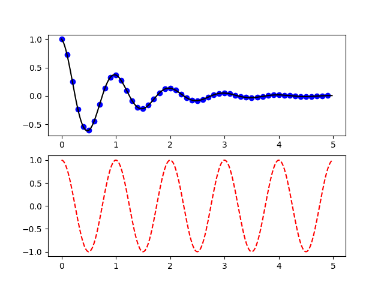
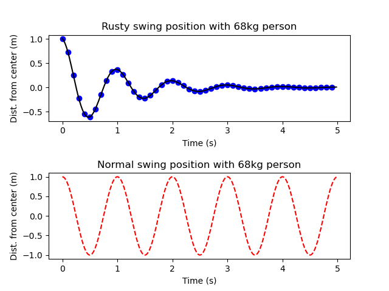

# Reading 4: Using and Sharing Code
{: .no_toc }

- TOC
{:toc}

As a software designer, you should gain some familiarity with using other
people's code, including code written by direct collaborators or included as
part of an external library. You should also become familiar with sharing and
explaining code to others.

As part of this, you may be required to generate, gather, process, show, or
explain data. These tasks are a core part of software design work, even if they
may not be explicit tasks. For example, you may be asked to show that rewriting
code a certain way makes it run faster than before, or explain to what extent
adding a new feature increases user engagement with your application or service.

To help you build these skills, this reading begins by discussing how to import
code from other files and provides an overview of some convenient portions of
the Python standard library. We then discuss some features of Python functions
that may be helpful as you read external documentation. After this, we will
switch gears to talk about reading and writing files in Python, which is a skill
that you will likely find yourself using often as you generate or process data.
Finally, we will end this reading with a discussion of computational essays and
data visualization, which may be helpful as you share and explain your code to
others.

## Using Existing Code

As you develop more complex code, you may find yourself implementing similar
functionality repeatedly. For example, in the `average_value` function above,
you saw that we added a list of numbers together by defining a variable to hold
the running total of numbers (`total_sum`) and used a `for` loop to add each
number in the list to this total.

Implementing the same functions over and over can be helpful for building good
habits, but is generally not an efficient way to develop software. In this
section, we talk about ways in which you can reuse existing functions to write
cleaner and more efficient code.

#### Using Try & Except Statements

A `try` & `except` statement can be used to handle any errors that are potentially
expected as the result of a certain function. There are two parts or "blocks"
that make up this construct: the "try" block contains the code that you want to
run, but might expect a specific exception to occur in. The "except" block is
what runs once the type of exception specified shows up in the code.

When the code is run, it will first attempt to complete the code in the try
statement. If there are no issues, the except section will be ignored; however,
if an exception occurs, the execution will jump to the except clause & continue
from there.

A try statement can have more than one except clause, where the various except
clauses handle different types of exceptions; generally you do not want to use
a "generic" except clause without specifying the type of exception you are
handling. If there is no except clause corresponding to the type of exception
that occurs, the program execution will stop (much like a normal error).

```python
def input_divide():
  try:
    input_1 = int(input("Enter an integer."))
    input_2 = int(input("Enter another integer."))
    div = input_1 // input_2
    print("Result: ", div)
  except ValueError:
    print("Not a valid integer; try again.")
    input_divide()
  except ZeroDivisionError:
    print("Please make sure that the second integer is not zero.")
    input_divide()
```

Note that multiple errors can be handled in one block (for examples,
`except: ValueError, ZeroDivisionError`) or all errors can be handled with just
`except:`, though the latter is considered bad style.

### More Common Functions and Methods

Python has a number of [built-in
functions](https://docs.python.org/3/library/functions.html#sum) that are, for
the most part, always available in the interpreter and in programs. (You can
technically overwrite these functions by assigning to them, but you shouldn't.)
You have already seen a few of these functions already: the often used `print`,
`range`, and `len`, as well as type conversion functions such as `int`, `str`,
and `list`.

Using these functions is recommended for two reasons. First, they are more
convenient: it would be a pain to have to write a `for` or `while` loop every
time you wanted to find the length of a list or string. Second, they are
typically implemented in a more efficient way than most Python programmers would
be able to do, so they will usually run faster and require less memory.

Below, we list a few built-in functions that you might find useful.

#### `isinstance`: Check a Type

The [`isinstance`](https://docs.python.org/3/library/functions.html#isinstance)
function takes a variable and a type. It returns `True` if the variable is of
that type and `False` otherwise.

```python
>>> isinstance("abc", str)
True
>>> one_two_three = [1, 2, 3]
>>> isinstance(one_two_three, int)
False
```

#### `join`: Concatenate a String List

The [`join`](https://docs.python.org/3/library/stdtypes.html#str.join) method of
strings allows you to concatenate a list of strings into a single string:

```python
# This returns "Use the Force"
" ".join(["Use", "the", "Force"])
```

As you can see, the string you use before the `.join` part of the function call
is used in between items in the list. If you want to quickly concatenate a list
of strings without any separation between them, you can use the empty string:

```python
# This returns "R2-D2"
"".join(["R", "2", "-", "D", "2"])
```

#### `enumerate`: Loop through Indices and Values

The [`enumerate`](https://docs.python.org/3/library/functions.html#enumerate)
function allows you to loop through a sequence's numerical indices and items at
the same time. Similar to the `items` method of dictionaries, the `for` loop
used to do this has two variables.

```python
number_words = ["zero", "one", "two"]
for index, word in enumerate(number_words):
    print(f"{index} is called {word}")
```

This code prints the following:

```
0 is called zero
1 is called one
2 is called two
```

### Import Statements

You have already seen in worksheets and assignments that you can use code from
`.py` files in Jupyter notebooks without having to copy and paste the code into
a notebook cell. You did this using the syntax `from X import Y`, where `X` was
the name of a file and `Y` was the name of a function or variable to import.

In general, you can use the `import` keyword to make code in other files
accessible to the current file, whether you are working in a Jupyter notebook or
in a Python file. There are two ways to use the `import` keyword:

- `from X import Y`
- `import X`

where `X` is the filename and `Y` is the function or variable defined in `X`. In
a Python file, these lines should be placed at the top of the file.

For now, you should assume that file `X` must be in the same directory as the
file you are importing into, with one exception that you will see later in this
reading. (There are ways to access files in a different directory, but that's a
topic for a later reading.)

You have already seen import statements of the form `from X import Y`, which let
you use `Y` as if it were defined in the current file. You can import multiple
things `X` this way, using something like `from X import Y, Z`.

#### Import Syntax Tradeoffs

You should be careful when you use `from X import Y` that you do not also have a
variable called `Y` in your code. If this happens, the one that was defined
later will overwrite the previous one. In Jupyter notebooks, it can be
especially easy to do this, since `import` statements do not all appear at the
top of a notebook, and the order in which you run cells matters.

You may also see `from X import *` on Q&A sites. As in Bash, the asterisk (`*`)
is a wildcard that matches anything, and thus this statement will import
everything from `X`. You should not use this form because it is much harder to
keep track of what is being imported (and what you might overwrite in your
code).

A safer way to import code is to use the form `import X`. This will make all the
variables in `X` available to you, but you access those variables slightly
differently. Rather than using the variables `Y` and `Z`, for example, you would
use `X.Y` and `X.Z`. This method is more tedious to write but avoids the
overwriting issues mentioned above.

#### Import Syntax Example: Unit Testing

Suppose you have a file called `average.py` that contains a function called
[`average_value`](https://softdes.olin.edu/docs/readings/2-sequences-testing-state/#example-list-average), and you
want to write unit tests for this function in a file called `test_average.py`.
To make sure that you can access the `average_value`
function from `test_average.py`, you need to use an import statement like this:

```python
from average import average_value


def test_ones_average():
    assert average_value([1, 1, 1]) == 1.0


def test_single_average():
    assert average_value([1]) == 1.0
```

Or, if you used a plain `import` statement:

```python
import average


def test_ones_average():
    assert average.average_value([1, 1, 1]) == 1.0


def test_single_average():
    assert average.average_value([1]) == 1.0
```

### The Python Standard Library

Beyond built-in functions and methods, Python provides a standard library with
commonly used functions for convenience. These features are split into different
modules, each of which you can import using the syntax above. You can view the
entire library [here](https://docs.python.org/3/library/).

The [`math`](https://docs.python.org/3/library/math.html) module provides some
common math functions , such as `ceil` and `floor` (which round up and down to
the nearest integer, respectively), `sqrt` (which takes the square root of a
number), and the standard trigonometry functions. It also provides some useful
constants: `inf` represents infinity, and `pi` is the well-known constant that
begins with 3.14.

The [`random`](https://docs.python.org/3/library/random.html) module provides
functions to generate random numbers, including ints (`randint`) and floats
(`random` or `uniform`). It also provides functions to pick a random element of
a sequence (`choice`) or to put the elements of a sequence in a random order
(`shuffle`).

The [`string`](https://docs.python.org/3/library/string.html) module provides
functionality to build specifically formatted strings (though much of this
functionality can be done with
[f-strings](docs/readings/2-data-structures-functions/#string-formatting)). It
also provides helpful strings that represent different sets of characters, such
as all uppercase letters (`ascii_uppercase`), numbers, (`digits`), and
punctuation (`punctuation`).

The [`collections`](https://docs.python.org/3/library/collections.html) module
provides a variety of container data structures designed for holding items.
While most of them have fairly specialized use cases, one is rather helpful in
many situations: `defaultdict`. This essentially allows you to create a
dictionary that assumes a default value for any key not in it. This saves you
the trouble of checking whether something is in the dictionary before using it:

```python
from collections import defaultdict

letter_count = defaultdict(int)
sentence = "King Philip Came Over For Great Spaghetti"
for character in sentence:
    # Any key not in letter_count is mapped to 0 when you try to access it.
    letter_count[character] += 1
```

As you progress through this course, we will discuss a few other modules that
will be useful on future assignments and projects.

## External Documentation and Python Function Syntax

As you continue to learn Python, you will inevitably find the need to learn and
use external libraries. Most libraries with a reasonably large community will
have documentation for their functions, and the description of a function's
parameters and return types are often presented in a specific format.

In this section, we will list a few features of Python's syntax that may be
helpful in understanding external documentation.

As you read through documentation and with reading and writing files, you will
see uses of two Python features you may be unfamiliar with: default arguments
and keyword arguments. (See the [official documentation of
`print`](https://docs.python.org/3/library/functions.html#print) for an
example.) A few of the libraries whose documentation pages we link to have
functions that make extensive uses of these features, and thus before getting
into these libraries, we explain what default arguments and keyword arguments
are.

### Default Arguments

A *default argument* is a way of making a function parameter optional, setting
it to some default value if the argument is not provided. Here is an example:

```python
def answer_to_life(number=42):
    return f"The answer to life, the universe, and everything is {number}"
```

Notice that we write `number=42` as a parameter, with no spaces around the
equals sign (`=`). This means that we can call the function one of two ways:
with an argument, like `answer_to_life(27)` or simply as `answer_to_life()`. If
we use the latter, `number` is set to 42 by default.

### Keyword Arguments

Some functions have many parameters with default arguments, like this:

```python
def many_default_arguments(param_1=42, param_2="spam", param_3=True,
                           param_4=3.14):
    # Do things here...
    pass
```

If you just wanted to use a different value for `param_4`, it would be tedious
to use the default values for every other parameter, like this:

```python
many_default_arguments(42, "spam", True, 1.618)
```

To avoid this syntax, you can use a *keyword argument*, which allows you to
define the values of specific parameters. Visually, it looks quite similar to a
default argument, except that it is used when calling the function:

```python
many_default_arguments(param_4=1.618)
```

This leaves the other arguments as their default values.

### Argument Lists

If you look at the [official documentation of
`print`](https://docs.python.org/3/library/functions.html#print), you will see
the following:

```python
print(*objects, sep=' ', end='\n', file=sys.stdout, flush=False)
```

The `*objects` means that you can pass any number of arguments to the function,
like this:

```python
# This prints "Hello, I am 42 years old"
print("Hello, I am", 42, "years old")
```

In external libraries, you may sometimes see this written as `*args` to indicate
that you pass some number of arguments.

If your arguments in a list, you can pass it directly to the function using a
similar syntax:

```python
# This prints "Hello, I am 42 years old"
words = ["Hello, I am", 42, "years old"]
print(*words)
```

Here, the asterisk (`*`) essentially "breaks down" the list into separate
arguments before passing them to `print`. If you already have arguments to a
function in a list or tuple, you may find this syntax easier to use.

### Argument Dictionaries

If you look at the official documentation of the [`format` method for
strings](https://docs.python.org/3/library/stdtypes.html#str.format) (a
precursor to f-strings), you will see the following:

```python
str.format(*args, **kwargs)
```

The `**kwargs` indicates that the function can take an arbitrary set of keyword
arguments, like this:

```python
intro = "Hello, I am {age} year{plural} old".format(age=42, plural="s")
```

Here, as long as the variable shows up in the string, you can set its value as a
keyword argument in `format`.

Similarly to how you can use `*` with a list when passing it to a function that
takes an argument list, you can use `**` with a dictionary to pass it to a
function that takes keyword arguments, like this:

```python
age_details = {age: 42, plural: "s"}
intro = "Hello, I am {age} year{plural} old".format(**age_details)
```

## File Input/Output

In the context of computing, you are likely familiar with the term *file* as
some data that is stored as a unit on your machine, like a document,
application, or video. However, a *file* is simply a way to store or record
data, just like a file of paper documents. In the UNIX family of operating
systems (of which Linux is one), nearly everything is treated as a file:
directories, a network device like a wi-fi card, USB drives, and HDMI ports are
simply treated as devices that the computer can write data to or read data from.
This is an example of *abstraction*: by treating all of the above as files, they
can be written to or read from in almost exactly the same way, using the same
set of functions.

Below, we describe the elements of a file and the ways to work with them.

### File Paths

A file's *path* provides two important pieces of information about a file: what
it is called and where on your machine it is located. You have actually already
seen paths in this course: `~/softdes/foo.py` is a path, for example. That path
describes the file location: within the current user's home directory (`~`), in
the `softdes` directory, the file `foo.py` is the one that this path represents.
The file's name is a bit trickier: we would colloquially call this file
`foo.py`, but to differentiate from a different file named `foo.py` in another
directory, the file's name is actually the entire path (`~/softdes/foo.py`).

(As an aside, the file's location is also not completely straightforward, since
the file data is actually stored on a device like a hard drive, and the location
of the data on this hard drive is not always sequentially organized. That being
said, the operating system takes care of this for us, so we can treat the path
as being the definitive location of a file.)

The [`os.path`](https://docs.python.org/3/library/os.path.html) module of the
Python standard library provides some convenience functions for working with
paths. Its functions work on both UNIX operating systems as well as Windows.
This can be useful, because among other things, Windows writes paths with
backslashes(`\`) instead of forward slashes (`/`), such as in
`C:\Users\admin\Documents`.

### `open` and `close`

There are two ways to access a file: *reading* data from it and *writing* data
to it. Both are core operations to data processing. For example, if you are
writing a Markov text generator, as you already did in a previous assignment,
reading a source text from a file allows you to simply download a text from the
Web and load its contents into your program to be able to generate random text.

In Python, to read from or write to a file, you need to ask the operating system
to provide you access to it first. You can do this by using the built-in
function `open`, which provides you with a *file object* that you can use to
access the file. The ["Reading and Writing
Files"](https://docs.python.org/3/tutorial/inputoutput.html#reading-and-writing-files)
section of the official Python tutorial describes how to do this. You should
read this section before moving on.

The built-in function `close` tells the operating system that you no longer need
access to the file. Forgetting to close an open file is a common mistake, and in
rare cases can have confusing or catastrophic consequences. If another program
is trying to write to a file before your program has closed it, for example, the
file contents may be what your program wrote to it, what the other program wrote
to it, some combination of the two, or something entirely different. To avoid
this, we recommend always using the `with` form of opening files, like this:

```python
with open("foo.txt", "r") as f:
    # Do stuff with the file here...
```

### `read` and `write` sometimes have better alternatives

Once you have an open file, you need to actually read the data into a form that
can be used by the rest of your program, such as in a string. The ["Methods of
File
Objects"](https://docs.python.org/3/tutorial/inputoutput.html#methods-of-file-objects)
section of the official Python tutorial describes ways to do this using the
`read` and `write` functions. You should read this section before moving on.

As the documentation mentions, you can use `f.readlines()` on a file object `f`
to get a list of strings representing every line in the file. But if the file is
large, this can slow your machine down quite a bit. Because of this, you are
strongly recommended to use the `for line in f:` syntax:

```python
with open("foo.txt", "r") as f:
    for line in f:
        # Do something with line here, like the following.
        print(line.strip())
```

The only thing that you should be aware of if using this syntax or
`f.readlines()` is that each line will have a newline character (`\n`) at the
end of each line (except perhaps the last), so you should use the `strip`
function to get just the text of the line. If you used `print(line)` in the
example above, you would instead get an extra blank line between every line in
the original file.

For writing to files, you need to add the newline character yourself to start a
new line if using `f.write()`. If you are writing a file line by line and want
to have line breaks added for you, as `print` does, use this syntax instead:

```python
print("Hello world!", file=f)
```

The `file=f` keyword argument here tells Python to write `Hello world!` to the
file object `f` instead of to the screen (sometimes called *standard output* or
`stdout`).

## Computational Essays

As you become more experienced in software design, you may want to share your
code with others in a way that allows them to understand, use, and build on your
code. One powerful way to do this is through a *computational essay*, which is a
document that intersperses text and code. Through this format, you can describe
your work to others in a readable way while also providing a way for the reader
to run your code and visually see the results.

You have already used one format for a computational essay in this course:
Jupyter notebooks. Other fields of engineering may use [live
scripts](https://www.mathworks.com/help/matlab/matlab_prog/what-is-a-live-script-or-function.html),
which is the equivalent concept for MATLAB. One of the oldest forms of the
computational essay as we know it is Mathematica, which was started by Stephen
Wolfram (of [WolframAlpha](https://www.wolframalpha.com/) fame, among other
things).

To help you get a better sense of what a computational essay might look like and
how to write a compelling computational essay, we recommend that you read
Wolfram's own
[essay](https://writings.stephenwolfram.com/2017/11/what-is-a-computational-essay/)
on the subject, and you should do this before you move on.

## Data Visualization

For the last part of this reading, we want to reiterate or build on points made
in Wolfram's essay, particularly in the area of data visualization. Simply
getting and processing data is not always enough - often, the most important
task is to make a compelling point with data. To effectively do this, you should
learn different ways of visualizing data.

For this purpose, we will use Matplotlib and Pyplot. Matplotlib is a plotting
library for Python whose syntax is designed to be relatively similar to the
plotting syntax of MATLAB. Pyplot is a part of Matplotlib that is particularly
well-suited for interactively working with plots, as you often do in Jupyter
notebooks.

In this section, we will point you to some resources for learning these
libraries, and provide some tips on how to effectively visualize data.

### Prepare a Jupyter notebook for plotting

By default, plots in a Jupyter notebook will not be shown in the notebook
itself. To make plots appear within a notebook, you will need to add and run a
cell with the following code at the top of your Jupyter notebook:

```
%matplotlib inline
```

As with the code that you run to make VS Code read the latest version of files,
you will need to run this every time you start or restart your notebook.

### Learn Matplotlib and Pyplot

Matplotlib includes some excellent tutorials, which you should go through to
learn about how to use the library. We recommend you read the tutorials below in
order:

- [Pyplot tutorial](https://matplotlib.org/stable/tutorials/introductory/pyplot.html)
- [Usage
  Guide](https://matplotlib.org/stable/tutorials/introductory/usage.html#sphx-glr-tutorials-introductory-usage-py)
  (up to, but not including, the "Backends" section)
- [The Lifecycle of a Plot](https://matplotlib.org/stable/tutorials/introductory/lifecycle.html#sphx-glr-tutorials-introductory-lifecycle-py) (optional, but helpful as an example)

### Contextualizing Plots

Though the tutorials above explain a good deal about how to create and work with
plots, they don't say much about what actually makes a good plot.

By far the most important thing to know as when you design and create a plot is
the point you are trying to make.

Here is a set of two plots from the Pyplot tutorial:



We don't know the point this graphic is trying to make for a number of reasons:
(1) we have no idea what the numbers on the $x$ or $y$ axis represent, (2) the
plot doesn't have a title, so we don't know what the overall plot is showing,
and (3) we don't have the context, so we don't know why we are seeing this plot.

**The purpose of a plot is to provide evidence or support for a claim you
make.** So for example, suppose that you have two swings, one of which is rusty,
and claim that the rusty swing stops earlier than the other. You could conduct
an experiment to analyze this: sit the same person on each swing in turn, start
them forward of center, and release them, tracking their distance from the
normal hanging center of the swing over time. Then, saying that the blue plot
represents the position of the person in the more rusted swing over time gives
more credibility to your claim.

In general, always explain the point of your plots with proper context,
especially when making them publicly accessible.

### Labeling Plots

While we now know what the point of the above plot is, we still don't know some
key details. How heavy was the person sitting in the swing? How long did you
track their position for? Is their position measured in feet, inches, or meters?

To make sure that the plot effectively provides evidence for a claim, this type
of information is necessary. However, not all of it has to be included in the
plot itself. Typically, it's best if the plot includes at least a title and a
labeled set of axes.

If we adapt the code used to produce the two plots above, we can get a plot that
looks like this:



Now we can clearly see what each plot is showing and that they are plotting the
same units, making it easier to quickly compare the two sets of data visually.
In general, it's important to show both the quantity represented and the units
when labeling axes. (The exception is if the quantity has no units.) In
addition, you should choose a title that simply describes what the data
*represents*, not the point that you are trying to make. However, you should
also make sure that you do not simply state what the data is; in the figure
above, titling one of the plots "Swing position over time" would be too vague,
particularly since both plots can be described this way.

### Explaining Plots

Beyond properly labeling the plots and making a point, it's important to
highlight the important parts of the plot so it's clear how the plot provides
evidence for your point. Don't assume that the reader will just make the
connection on their own. For example, you might write the following after
showing the plot above:

> The above figure shows the positions of the two swings over time. As we can
> see, the rusty swing shows a clear decrease in the distance from the center
> over time, with the peak distance at less than 50cm from the center at 1
> second. The normal swing, on the other hand, has almost the same distance (if
> not the same) even at 5 seconds, when the rusty swing has almost stopped
> moving.

This explanation makes it very clear how the plot connects with your claim, and
the plot itself includes enough precise information to effectively back up your
claim.