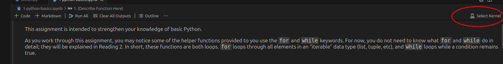

# Computational Setup Instructions: SoftDes Spring 2026

This year in SoftDes, you'll have the option of using Unity, part of the Massachusetts Green High Performance Computing Cluster. Although it's optional, we recommend using Unity (at least to start!). It's great for skill-building and will hopefully reduce friction, getting you up and running quickly. This document will introduce you to the system.

**Please read the instructions slowly and carefully.** If you get stuck, take a little break, come back, and read the instructions carefully again.

> **Note:** Your SoftDes account on Unity will not last forever! It's just for the semester. Be sure to download any work you want to keep.

## Request an account

Please follow the ["Olin/UNITY Onboarding Instructions"](https://docs.google.com/document/d/1bABrtPAu38MCqoUF32hEEG7cJuS25B1lR3wR83JWKNE/edit?usp=sharing) to request an account. Since you're enrolled in this class (or a CA), you have permission from someone at Olin. For SoftDes, you'll want to request an account with `pi_softdes26_olin_edu`. If you have an account with a different pi already, you'll still want to request an account with `pi_softdes26_olin_edu` – we've got some special features on that account just for SoftDes (like 288 cores reserved for us during class times, allowing us to skip the queue!).

## Login and try VS Code

1. After your account is approved (you'll get an email) go to: https://ood.unity.rc.umass.edu/
2. Click the Olin logo (or type "Olin" into the "Search for Organization" box). You should be able to login using your Olin credentials.
3. On the top navigation bar, click "Interactive Apps" and then "VS Code"
4. You should now see a page with text boxes populated with default values. Unity is a supercomputer, so it's got a lot of computing power, and it needs to allocate and manage all the user requests it gets. It does this with a program called Slurm. As you gain experience with Unity, you can start asking for specific things you want, like particular processors that are optimized for your code.
5. For now, take a look at the "Maximum Job Duration" - this is the amount of time you'll have to use VS code during your session. Make sure it is what you need for whatever you are doing now, because it's going to kick you off once that time has passed. Some schedulers prioritize jobs with shorter durations. (The maximum for this is 8 hours, but know that there's ways to run code continuously for weeks on Unity if needed for projects later on in the semester).
6. For "Extra Arguments for Slurm" enter `-A pi_softdes26_olin_edu`. This tells Slurm to run VS code in the right directory that has our SoftDes installs.
7. *(Optional)* We have a class reservation to use a portion of the Unity cores during Tuesday and Friday class times. This should work automatically (they are "magnetic") but you can also specify them in "Extra Arguments for Slurm" as `--reservation=softdes26_t` (for Tuesday) and `--reservation=softdes26_f` (for Friday). If you access Unity not in class hours, you might have to wait a minute or two before the session starts.
8. *(Optional)* It's okay to ignore the other arguments for now. If you want to learn about them and change them as desired, check out these help pages: [Slurm Documentation](https://docs.unity.rc.umass.edu/documentation/jobs/slurm/) and/or [HPC Theory](https://docs.unity.rc.umass.edu/documentation/get-started/hpc-theory/threads-cores-processes-sockets/)

## Configure VS Code

Now we're going to add a couple of bells and whistles to VS Code. You should only have to do this once.

1. You might see a window that says "browse popular extensions", or you can click on the icon on the left side (bottom) that looks like three blocks together with one block offset.
2. Search for "autopep8"; a formatter extension and click "install."
3. Search for "pylint"; a different formatter extension and click "install."
4. Search for "quarto"; a scientific and technical publishing system and click "install."
5. Search for "GitHub Pull Requests and Issues" extension and click "install". Note that this adds a little GitHub icon that looks like the silhouette of a cartoon animal with ears to the left side. You'll use this later.
6. Search for "Jupyter." Select the one that is just called "Jupyter" and has >5 million downloads, and click "install."
   
   

7. *(Optional)* You may have to configure your browser so that it allows VSCode to access your clipboard: this will make things easier later. See instructions here: [VS Code Clipboard Access](https://code.visualstudio.com/docs/remote/codespaces#_how-do-i-allow-vs-code-to-access-my-clipboard-for-reading). If you have Firefox, you may have to click on the shield icon to the left of the web address and add `https://ood.unity.rc.umass.edu` to the list of exceptions to "Advanced Tracking Protection."

## The course GitHub

Although the course readings have details on GitHub, Unity also has an overview that you may find helpful: [Unity Git Guide](https://docs.unity.rc.umass.edu/documentation/get-started/git-guide/)

1. To start, you need to fork the course repository. This is located at https://github.com/olincollege/softdes-2026-01. You will need to be logged into GitHub to access this repo. At the top right of the page, you should see a button labeled "Fork." Click it to fork the repo.
2. In your fork (not the main course repo), click the green button that says Code. It will open a drop-down menu; make sure HTTPS is selected. Copy the url. It should look like `https://github.com/myGitHubUsername/softdes-2025-01.git`. If you see olincollege instead of your GitHub username, do not use it, that is not your fork but rather the main course repo.
3. In the top right corner, click on the box with the big rectangle on top and the little rectangle on the bottom:
   
   
   
   This is called the terminal. (You can also click on the Menu → Terminal → New terminal) You'll use this later.
4. Move to the SoftDes working directory:
```
   $ cd /work/pi_softdes26_olin_edu/
```
   Note that on Unity, you don't want to run software in your home directory. The admins of Unity restrict the computing limits of home directories on purpose! They want you to work in an optimized directory, which for Unity is `/work/`.
5. Create your own softdes directory with your first initial and last name (replacing the placeholder [yourdirectory] below)
```
   $ mkdir [yourdirectory]
```
6. Click on the GitHub (creature with ears) icon on the left side. It will tell you haven't opened a folder. Open `/work/pi_softdes26_olin_edu/[yourdirectory]` where [yourdirectory] is what you created in the previous step.
7. Click "log into GitHub" and follow the prompts.
8. From VS Code's "Welcome" tab, click "Clone Git Repository" or type "clone git" into the command palette.
9. The answer to "Choose a folder to clone" is `https://github.com/myGitHubUsername/softdes-2025-01.git`, which you got in Step 1.
10. The place you want to clone it is `/work/pi_softdes26_olin_edu/[yourdirectory]` where you replace "astudent" with your folder you made in Step 5.

## Activate Virtual Environment (to allow Quarto)

Throughout this course, you will be working with a tool called Jupyter. Jupyter notebooks are a neat and interactive way to integrate text and code together, popular in data science. Unfortunately, the ipynb (Interactive PYthon NoteBook) format is notoriously difficult to work with in version control systems such as git, another tool you will use in this course.

For that reason, we have you install Quarto, an open-source publishing system. Quarto has a file format called qmd (Quarto Markdown), which we use as an intermediate format for managing Jupyter notebooks.

1. Check which directory you are in by typing `pwd` into the terminal. If the result is not `/work/pi_softdes26_olin_edu/[yourdirectory]` type `cd /work/pi_softdes26_olin_edu/[yourdirectory]` to move to the directory. We always want to be working in this directory!
2. Go to the command palette of VS Code, you can click on the gear icon in the bottom right corner and then "command palette" or hit F1.
3. Type "Python: Select Interpreter" and select it when it pops up.
4. Then select "Select interpreter path" and enter `/work/pi_softdes26_olin_edu/class_venv/bin/python3.12`
5. This is a virtual environment created for the course.
6. Test: you should be able to open the .qmd markdown files!

## Setting Remotes

1. In your terminal run `git remote add upstream URL`, replacing "URL" with the URL for the main SoftDes course repo (`git@github.com:olincollege/softdes-2025-01`).
2. To test that the remote is set correctly, run `git remote -v`. This should output the following:
```
   origin	git@github.com:myGithubUsername/softdes-2025-01.git (fetch)
   origin	git@github.com:myGithubUsername/softdes-2025-01.git (push)
   upstream	git@github.com:olincollege/softdes-2025-01.git (fetch)
   upstream	git@github.com:olincollege/softdes-2025-01.git (push)
```

## What in the World Did I Just Do?

> You do not need to read this section to go on with your coursework, but you might find yourself asking: "what's the difference between forking and cloning?"

**Forking** is creating a personal copy of the main repo on the GitHub servers. Forks are especially useful for collaboration with many users. Each developer can make a fork of the main repo and work on changes separately. These "downstream" changes can then be merged back "upstream" into the main project repo.

**Cloning** is copying the contents of a repo on a server to your computer. When you make changes to your locally cloned repo, they will not be present on the server until you commit and push your changes. If changes are pushed to the server, they will not be present on your clone until you pull.

When you set the remote in your cloned repo, you are setting an additional source for the project. You set an upstream in the clone of your fork so you can pull changes that are made to the main course repo. For example, a new assignment might get pushed to the main course repo. You can then pull changes from upstream to your version of the repo.

## Helpful Notes

Unity has several ways of interacting. This is nice because you can pick what works best for you but can also be confusing. You can look at files through a file browser, or run jupyter notebooks from a separate notebook app. Use the same Slurm arguments you used for the VS Code app for the Jupyter/MATLAB app.

You can also look at Jupyter notebook files through VS Code.

1. Set the interpreter to the class venv: in the command palette, type "Interpreter" and select "Python: Select Interpreter", then "Enter interpreter path...." (folder icon), then "Find...", and type or paste `/work/pi_softdes26_olin_edu/class_venv/bin/python`
2. In the upper right hand corner of the ipynb screen, use the "select kernel" button, then Python Environments, then class_venv
   
   

3. You should now be able to run cells without a separate kernel set up

You can download a file from VS Code directly by right clicking on it.

## Getting Help

There's lots of ways to get help this semester!

- Check out the Unity Documentation: https://docs.unity.rc.umass.edu/documentation/
- Ask a friend in the class for help. (Or make a friend by asking for help!)
- Ask a CA or Instructor or the class discord for help.
- Ask for help on the Unity Slack channel, following these instructions: [Asking Questions on Unity Slack](https://docs.unity.rc.umass.edu/documentation/help/asking-questions/)
